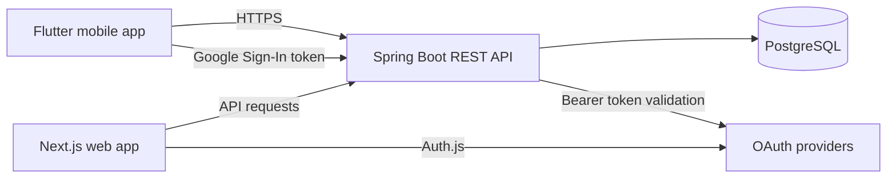

# DAPYO

> Find your next hike. Find your people.

The DAPYO is a free social platform for discovering, organizing,
and joining hikes with other people. It connects hikers, organizers, trails,
scheduled events, activity history, reputation, and lightweight gamification
in one place.

The product is built around a simple loop:

**DISCOVER → JOIN → HIKE → EARN → CONNECT → REPEAT**

This is not primarily a hiking tracker. Its core question is:

> I want to hike this weekend — where should I go, and who can I hike with?

## Product prospect

Hiking communities currently coordinate across social media posts, group
chats, trail apps, and spreadsheets. That makes it difficult to find a
suitable hike, evaluate an organizer, confirm availability, and keep a record
of participation.

This project turns unstructured hiking activity into searchable, actionable
events:

```text
Discover → Plan → Join → Hike → Complete → Socialize → Progress
```

### Who it is for

- **Beginner and solo hikers** looking for accessible hikes, reliable people,
  and an easy way to join a group.
- **Experienced hikers** looking for new trails, companions, challenges, and
  a persistent hiking history.
- **Hiking organizers** who need structured events, participant management,
  communication, attendance, and reputation.

Professional guides, tour operators, transportation providers, and outdoor
businesses are future users, not part of the initial product scope.

### What makes it different

| Product | Primary strength |
| --- | --- |
| Facebook Groups | Broad community |
| Strava | Activity tracking |
| AllTrails | Trail discovery |
| Komoot | Route planning |
| **DAPYO** | **Scheduled hiking and social participation** |

The product owns the space between “I want to hike” and “I completed a hike”:
discovery, scheduling, joining, group coordination, and trusted participation.
Its long-term advantage comes from the hiker graph created by real activity:
relationships, trail preferences, event history, attendance, and reputation.

## MVP scope

The first release should validate one question:

> Will hikers use the app to discover and join hikes with other people?

### Core capabilities

- Email and Google / Apple authentication.
- Hiker profiles with location, experience level, and preferred difficulty.
- A structured mountain and trail database.
- Create, publish, and manage hiking events.
- Discover upcoming hikes with date, location, distance, difficulty, and slot
  filters.
- Join, leave, and view participants for a hike.
- Basic event discussion and notifications.
- Manual activity completion with distance, duration, elevation, and photos.
- User profiles with hiking history, XP, levels, and basic badges.
- Reporting, blocking, organizer reputation, and admin moderation.

Advanced GPS tracking, navigation, live location sharing, SOS, payments,
subscriptions, and marketplace features are intentionally deferred.

## Product principles

1. **Participation over tracking** — the goal is to get people hiking.
2. **Real-world activity over vanity metrics** — completed and repeated hikes
   matter more than app opens or downloads.
3. **Free community first** — core features remain free for hikers and
   organizers while the network is being built.
4. **Trust is a feature** — organizer quality, attendance, reporting, and
   reputation are core functionality.
5. **Don't build everything** — each feature should help users discover, join,
   complete, or repeat hikes.

## Success metric

The north-star metric is **completed group hikes per week**.

The supporting funnel is:

```text
New user → Profile completed → Hike viewed → Hike joined → Hike attended
          → Hike completed → Second hike → Hike organized
```

We will also track activation, attendance, completion, repeat participation,
organizer supply, and hike fill rate.

## Technical architecture

The repository is a full-stack monorepo for the product foundation:



The MVP uses a modular monolith. Core backend modules are expected to map to
the product domain:

```text
auth · users · mountains · hikes · participants · activities
gamification · social · notifications · reports · admin
```

### Current stack

- **Web:** Next.js, React, TypeScript, Auth.js, TanStack Query, Zustand, and
  shadcn/ui primitives.
- **Mobile:** Flutter and Dart with Riverpod, Dio, and generated OpenAPI
  client code.
- **Backend:** Spring Boot, Java 21, Spring MVC, Spring Security, JPA,
  Flyway, MapStruct, and Lombok.
- **Database:** PostgreSQL.
- **Tooling:** pnpm, Turborepo, Maven, Docker Compose, and GitHub Actions.

The codebase is currently an early product foundation; hiking-specific
modules are being developed against this architecture.

## Repository layout

```text
apps/
  backend/       Spring Boot API, migrations, and tests
  frontend/      Next.js web application and Auth.js
  mobile/        Flutter application and generated API client
packages/
  api-types/     TypeScript types generated from OpenAPI
infra/
  docker-compose.yml
  postgres/      Local database initialization
docs/
  hiking-app-product-docs/  Product vision, MVP, roadmap, and principles
  adr/                      Architecture decision records
```

## Local development

### Prerequisites

- Node.js 20
- pnpm 10.12.1 through Corepack or a matching local install
- Java 21
- Docker with Docker Compose
- Flutter SDK for mobile development

### Start the web and backend foundation

```bash
make dev
```

This starts local PostgreSQL on :5433, the Spring Boot backend on :8080, and
the Next.js frontend on :3000.

Open http://localhost:3000. Authentication configuration is documented in
[docs/google-github-oauth-setup.md](docs/google-github-oauth-setup.md).

### Run the mobile app

```bash
make mobile-gen   # install dependencies and regenerate the API client
make mobile-run
```

See [apps/mobile/README.md](apps/mobile/README.md) for Google Sign-In and device
setup.

### Tests and checks

```bash
make backend-test
pnpm --filter @app/frontend lint
pnpm --filter @app/frontend typecheck
pnpm --filter @app/frontend test --if-present
make mobile-test
```

Backend tests use Testcontainers for PostgreSQL. The frontend test command is
currently a placeholder until a Jest, Vitest, or Playwright suite is added.

## Product documentation

The product prospect is documented in [docs/hiking-app-product-docs](docs/hiking-app-product-docs):

- [Product vision](docs/hiking-app-product-docs/01-product-vision.md)
- [Problem statement](docs/hiking-app-product-docs/02-problem-statement.md)
- [Target users](docs/hiking-app-product-docs/03-target-users.md)
- [Competitive analysis](docs/hiking-app-product-docs/04-competitive-analysis.md)
- [MVP](docs/hiking-app-product-docs/07-mvp.md)
- [Core user flows](docs/hiking-app-product-docs/08-user-flow.md)
- [Safety and trust](docs/hiking-app-product-docs/10-safety-and-trust.md)
- [Metrics and validation](docs/hiking-app-product-docs/11-metrics-and-validation.md)
- [Technical MVP architecture](docs/hiking-app-product-docs/12-technical-mvp-architecture.md)
- [Roadmap](docs/hiking-app-product-docs/13-roadmap.md)
- [Product principles](docs/hiking-app-product-docs/14-product-principles.md)

Architecture decisions live in [docs/adr](docs/adr/). ADR files are append-only:
do not renumber them, and supersede old ADRs with a new ADR instead of editing
history.
