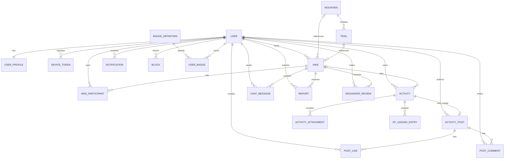
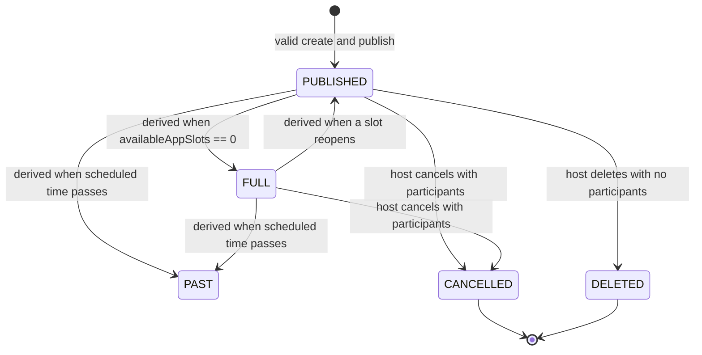
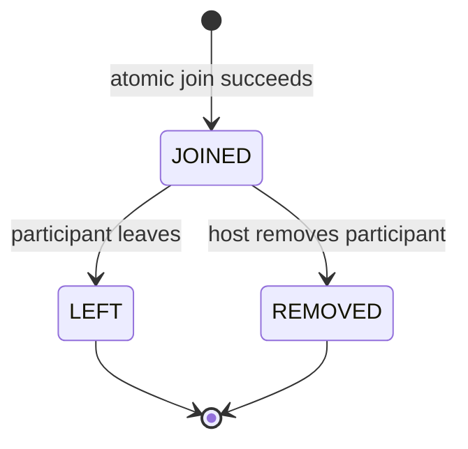
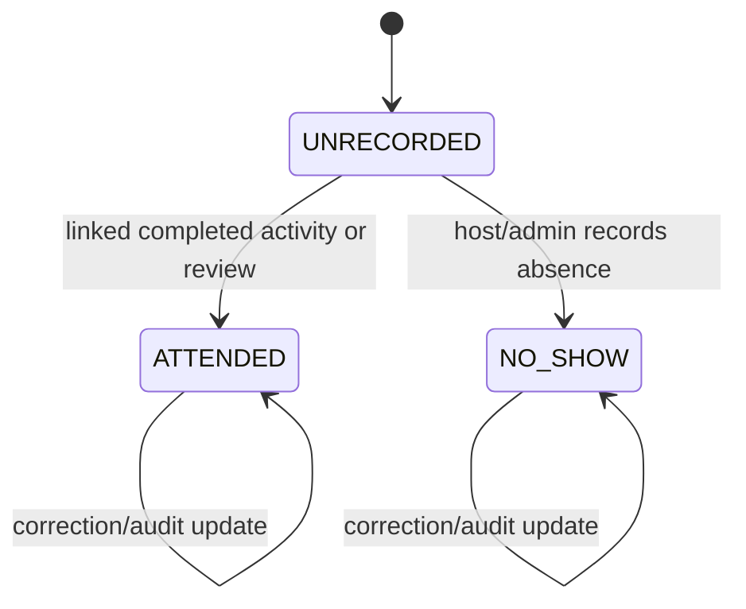
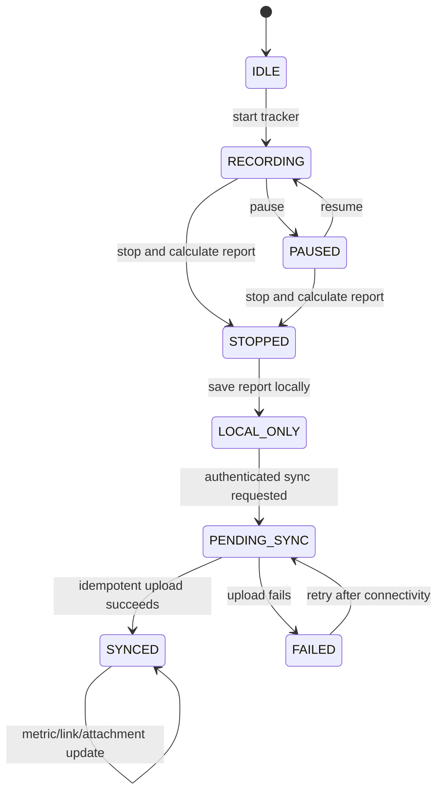
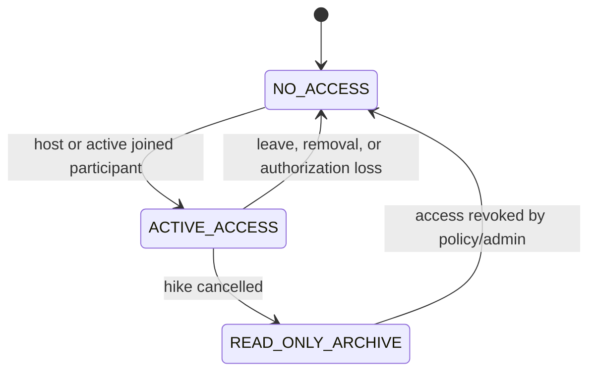
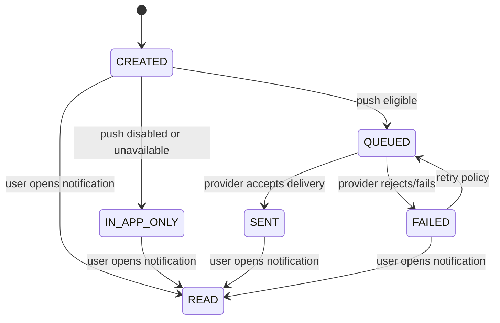
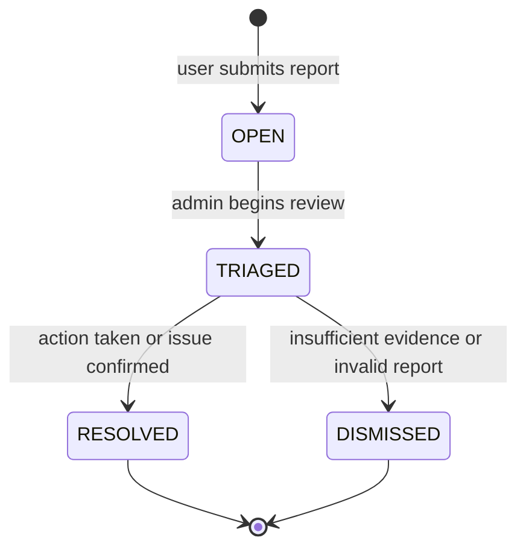

# Hiking Mobile MVP — Domain Model and State Diagrams

- **Status:** Draft for review before implementation planning
- **Date:** 2026-09-14
- **Product scope:** [Mobile MVP decision](../../hiking-app-product-docs/07-mvp.md)
- **UX scope:** [Mobile UX and screen specification](./2026-09-14-hiking-mobile-ux-screen-spec.md)
- **Ticket scope:** [Formal MVP ticket specification](./2026-09-14-hiking-mobile-mvp-ticket-spec.md)
- **Backend:** Spring Boot modular monolith with PostgreSQL and Flyway
- **Mobile:** Flutter with Riverpod, Dio, generated OpenAPI client, and local persistence

## 1. Modeling principles

1. The server is authoritative for identity, hikes, membership, chat access,
   rewards, social posts, notifications, and moderation.
2. The mobile device is authoritative for an in-progress GPS session until the
   activity is uploaded successfully.
3. Derived values are not persisted as independent truth unless they are needed
   for query performance and can be rebuilt safely.
4. Ownership and authorization are enforced in services and repositories, not
   in Flutter or request bodies.
5. Domain state is separate from UI state. UI loading/error states are mobile
   concerns and are not database enums.
6. Every user-generated record has an owner or actor and an audit trail where
   moderation, privacy, or financial impact could exist later.

## 2. Bounded contexts and module ownership

| Context | Backend module | Owns |
|---|---|---|
| Identity | `auth`, `user` | Provider identity, user profile, onboarding, analytics consent |
| Discovery | `mountain` | Mountains, trails, searchable location metadata |
| Hikes | `hike` | Public hike definition, location, schedule, capacity, lifecycle |
| Participation | `participant` | Joined membership, leaving, removal, attendance record |
| Communication | `chat` | Hike messages and membership-based access |
| Activity | `activity` | Uploaded activity summaries, route representation, attachments, hike links |
| Progress | `gamification` | XP ledger, levels, badge definitions, awards |
| Social | `social` | Shared activity posts, likes, comments |
| Notifications | `notification` | In-app notifications, device registrations, push delivery state |
| Trust | `trust` | Reports, blocks, organizer reviews, reputation projections |
| Administration | `admin` | Moderation actions, bans, operational management |

Modules communicate through service interfaces and stable DTOs. They must not
read each other’s repositories directly.

## 3. High-level relationship model



## 4. Core entities

### 4.1 User and profile

`User` remains the authenticated identity owned by the existing auth/user
modules. It contains provider identity, email when available, role, and audit
fields. `UserProfile` contains product-facing information.

`UserProfile`:

- `user_id` — one-to-one foreign key to `users.id`
- `display_name`
- `location_text`
- `location_lat`, `location_lng` — optional approximate home/location preference
- `experience_level`
- `preferred_difficulty`
- `age_range` — optional analytics field
- `discovery_source` — optional analytics field
- `analytics_consent_at` — nullable timestamp
- `onboarding_completed_at` — nullable until required fields are complete

Analytics fields are never returned by public profile DTOs. Exact age is not
required by the MVP; an age range minimizes unnecessary sensitive collection.

`DeviceToken`:

- `id`, `user_id`
- `token`
- `platform` (`ANDROID`, `IOS`)
- `last_seen_at`
- `revoked_at` — nullable

Unique active device tokens prevent duplicate push delivery registrations.

### 4.2 Mountain and trail

`Mountain`:

- `id`
- `name`
- `location_name`
- `latitude`, `longitude`
- `elevation_meters`
- `difficulty`
- `description`
- `basic_trail_information`
- `active`

`Trail`:

- `id`, `mountain_id`
- `name`
- `description`
- `distance_meters` — optional database metadata
- `elevation_gain_meters` — optional database metadata
- `active`

The database is a discovery source, not a navigation engine. A hike references
either a database mountain/trail or a custom location.

### 4.3 Hike

`Hike`:

- `id`, `host_id`
- `title`
- `location_source` (`DATABASE`, `CUSTOM`)
- `mountain_id` — optional
- `trail_id` — optional
- `location_name`
- `latitude`, `longitude`
- `scheduled_start_at`
- `difficulty`
- `max_participants`
- `external_guest_count`
- `description`
- `requirements`
- `status` (`PUBLISHED`, `CANCELLED`)
- `created_at`, `updated_at`

Exactly one location mode is valid:

- `DATABASE`: a valid mountain or trail reference plus a resolved display name
  and pin; or
- `CUSTOM`: a display name plus valid latitude and longitude.

Persisted status is intentionally small. `FULL` and `PAST` are derived states,
not independent lifecycle values:

```text
isFull = availableAppSlots == 0
isPast = scheduledStartAt <= currentTime
availableAppSlots = maxParticipants
                    - externalGuestCount
                    - activeJoinedAppParticipants
```

### 4.4 Hike participant

`HikeParticipant`:

- composite identity `hike_id`, `user_id` or a UUID plus unique constraint
- `joined_at`
- `membership_status` (`JOINED`, `LEFT`, `REMOVED`)
- `left_at` — nullable
- `removed_at` — nullable
- `removed_by` — nullable user reference

Only one active `JOINED` row may exist for a user/hike pair. Historical rows may
be retained for audit, but they do not count toward capacity after leaving or
removal.

Attendance is a separate record so membership and attendance are not conflated.

`AttendanceRecord`:

- `hike_id`, `user_id`
- `status` (`UNRECORDED`, `ATTENDED`, `NO_SHOW`)
- `source` (`LINKED_ACTIVITY`, `HOST_REVIEW`, `ADMIN_CORRECTION`)
- `recorded_at`

The MVP can begin with `UNRECORDED` and `LINKED_ACTIVITY`; host/admin attendance
review enables the trust workstream without changing membership semantics.

### 4.5 Chat message

`ChatMessage`:

- `id`, `hike_id`, `sender_id`
- `body`
- `created_at`, `updated_at`
- `deleted_at` — nullable

Chat access is derived, not stored on the message:

```text
allowed = user is hike.host
          OR user has an active JOINED participant row for the hike
```

Cancelled-hike chat is read-only archive access for the host and joined
participants. No new messages may be sent after cancellation.

### 4.6 Activity and route

`Activity` is the server representation of a completed activity:

- `id`, `owner_id`
- `client_activity_id` — unique per owner for idempotent upload
- `linked_hike_id` — optional
- `started_at`, `ended_at`
- `distance_meters` — required on save
- `duration_seconds` — required on save
- `elevation_gain_meters` — required on save
- `route_polyline` — required for GPS-tracked activities
- `notes` — optional
- `created_at`, `updated_at`

`ActivityAttachment`:

- `id`, `activity_id`, `owner_id`
- `storage_key` or provider reference
- `content_type`
- `byte_size`
- `created_at`
- `deleted_at` — nullable

Activity routes are private by default. A feed post can expose summary metrics
and selected media, but route visibility must not be inferred from hike
visibility.

The mobile local store additionally keeps:

- local activity id
- raw GPS samples and timestamps
- local calculated metrics
- local sync status
- last sync error
- recovery metadata for interrupted sessions

The local store is not an API entity and its sync state must not be added to the
server `Activity` enum.

### 4.7 Progress and rewards

`XpLedgerEntry`:

- `id`, `user_id`
- `source_type` (`ACTIVITY`, `JOINED_HIKE`, `ORGANIZED_HIKE`, `COMMUNITY_ACTION`)
- `source_id`
- `xp_amount`
- `rule_version`
- `created_at`
- unique reward key for idempotency

`UserProgress`:

- `user_id`
- `xp_total`
- `level`

`BadgeDefinition`:

- `id`, stable `badge_key`
- `name`, `description`
- `criteria_version`
- `active`

`UserBadge`:

- `user_id`, `badge_id`
- `awarded_at`
- unique user/badge constraint

XP is granted through ledger entries, never by incrementing a balance without a
source key. Retried activity uploads therefore cannot create duplicate rewards.

### 4.8 Social feed

`ActivityPost`:

- `id`, `activity_id`, `author_id`
- `visibility` (`FEED`)
- `created_at`, `deleted_at`

Only the activity owner can create or delete its post. An activity has at most
one active post in the MVP.

`PostLike` has a unique `(post_id, user_id)` constraint.

`PostComment`:

- `id`, `post_id`, `author_id`
- `body`
- `created_at`, `updated_at`, `deleted_at`

### 4.9 Notifications

`Notification`:

- `id`, `user_id`
- `category` (`JOIN`, `LEAVE`, `HIKE_UPDATE`, `HIKE_CANCELLED`, `REMINDER`, `CHAT_MESSAGE`, `LIKE`, `COMMENT`)
- `title`, `body`
- `link_type`, `link_id`
- `read_at` — nullable
- `created_at`

Push delivery metadata is separate or treated as delivery state:

- `push_status` (`NOT_QUEUED`, `QUEUED`, `SENT`, `FAILED`)
- `last_push_error` — safe operational detail only
- `push_attempts`

Read/unread and push delivery are independent dimensions. A failed push never
deletes the in-app notification.

## 5. Trust and administration entities

These entities support the parallel launch workstream in the MVP decision.

### Report

- `id`, `reporter_id`
- `target_type` (`USER`, `HIKE`, `POST`, `COMMENT`)
- `target_id`
- `reason_code`
- `description`
- `status` (`OPEN`, `TRIAGED`, `RESOLVED`, `DISMISSED`)
- `assigned_admin_id` — nullable
- `created_at`, `resolved_at`

### Block

- `blocker_id`, `blocked_id`
- `created_at`, `deleted_at`
- unique active pair constraint

Blocked users must not appear in recommendation/feed surfaces or interact in
ways explicitly disallowed by the trust policy. The exact filtering policy is
owned by the trust module.

### Organizer review and reputation

`OrganizerReview`:

- `id`, `hike_id`, `organizer_id`, `reviewer_id`
- `rating` from 1 to 5
- `comment` — optional
- `created_at`, `updated_at`
- unique reviewer/hike constraint

`OrganizerReputation` is a rebuildable projection containing aggregate rating,
organized-hike count, attendance rate, and report counters. It is not the source
of truth for reviews or reports.

### Moderation action

- `id`, `admin_id`
- `target_type`, `target_id`
- `action_type` (`WARN`, `HIDE`, `REMOVE`, `BAN`, `UNBAN`)
- `reason`
- `created_at`

Admin access uses the existing role system. Moderation actions are append-only
audit records.

## 6. State diagrams

### 6.1 Hike lifecycle



`FULL` and `PAST` are read-model states. Only `PUBLISHED` and `CANCELLED` are
persisted. A full hike remains publicly visible but cannot accept joins.

### 6.2 Membership and attendance



Attendance is orthogonal:



Leaving or removal does not automatically mark a user as a no-show.

### 6.3 Mobile activity and server sync



The activity can be recorded locally without authentication or network. It
requires authentication to upload, earn rewards, or share.

### 6.4 Chat access



Chat message authorization must be evaluated server-side on every read/write
request; the client’s cached membership state is not trusted.

### 6.5 Notification delivery



Read state is independent from push state. `READ` in this diagram means the
in-app notification’s `read_at` is set; it does not mean a push was opened.

### 6.6 Trust report



## 7. Domain invariants

### Capacity and participation

- `max_participants` must be positive.
- `external_guest_count` must be zero or greater.
- External guests cannot exceed maximum capacity.
- Active app participants plus external guests cannot exceed maximum capacity.
- Join is a transactionally protected operation.
- Duplicate active membership is rejected idempotently.
- The host does not consume an app-member slot.
- No waitlist record is created when a hike is full.

### Ownership and privacy

- Only the host can edit, cancel, delete, or remove participants.
- Empty hikes may be deleted; hikes with participants are cancelled and retained.
- Public hike details expose sanitized host/participant profiles only.
- Analytics fields are never included in public profile DTOs.
- Activity routes are private unless the owner explicitly shares an activity.
- Chat is available only to the host and active joined app participants; cancelled
  chat is read-only archive access.

### Activity and rewards

- A saved activity requires distance, duration, and elevation.
- GPS-tracked activities require a route polyline; manual correction is allowed
  when GPS data is incomplete.
- `client_activity_id` makes upload retries idempotent per owner.
- XP ledger keys make reward retries idempotent per source.
- An activity can remain standalone and need not be linked to a hike.
- An activity has at most one active feed post in the MVP.

### Safety and audit

- Reports, blocks, moderation actions, removals, and bans are auditable.
- Admin actions must not be represented as ordinary user edits.
- Deleting content must preserve enough moderation/audit metadata to explain the
  action without exposing deleted content to ordinary users.

## 8. Persistence and indexing guidance

Use Flyway migrations in dependency order. Add indexes for:

- `hike(status, scheduled_start_at)`
- hike location search fields or a future spatial index
- `hike_participant(hike_id, membership_status)`
- `hike_participant(user_id, membership_status)`
- `chat_message(hike_id, created_at)`
- `activity(owner_id, started_at)`
- `activity(client_activity_id, owner_id)` unique
- `notification(user_id, read_at, created_at)`
- `report(status, created_at)`
- active block pairs

Use foreign keys and explicit delete behavior. Do not cascade-delete activity,
moderation, or audit records merely because a UI item is hidden.

## 9. Domain implementation tickets

| Ticket | Scope | Depends on |
|---|---|---|
| DOM-001 | Identity/profile tables, onboarding fields, consent, public DTO redaction | Existing user module |
| DOM-002 | Mountain/trail tables and location reference validation | DOM-001 |
| DOM-003 | Hike table, derived capacity, lifecycle, and list indexes | DOM-001, DOM-002 |
| DOM-004 | Participant membership, atomic join/leave/remove, attendance records | DOM-003 |
| DOM-005 | Chat messages and membership-based authorization | DOM-004 |
| DOM-006 | Activity upload, route polyline, link semantics, idempotency | DOM-001, DOM-003 |
| DOM-007 | Mobile local activity store and sync state machine | DOM-006 |
| DOM-008 | XP ledger, progress, badges, and idempotent award rules | DOM-006 |
| DOM-009 | Activity posts, likes, comments, and privacy rules | DOM-006, DOM-008 |
| DOM-010 | Notifications, device tokens, and delivery state | DOM-001 |
| TRUST-001 | Reports, blocks, report status, and target authorization | DOM-001, DOM-003, DOM-009 |
| TRUST-002 | Organizer reviews and rebuildable reputation projection | DOM-004, TRUST-001 |
| ADMIN-001 | Moderation actions, bans, and admin management boundaries | TRUST-001 |

These domain tickets refine the implementation tickets in the formal MVP
specification; they do not replace the mobile screen tickets.

## 10. Domain test scenarios

1. A hike with capacity 10 and five external guests permits exactly five active
   app participants.
2. Concurrent joins for the final slot produce one `JOINED` membership and one
   full-capacity conflict.
3. A host with no participants can delete a hike; a host with participants can
   only cancel it.
4. A removed participant cannot read or send chat messages, even with a cached
   mobile session.
5. A cancelled hike preserves history and permits read-only archived chat.
6. A public profile response excludes age range, discovery source, and consent.
7. An activity records GPS locally with no network and survives app restart.
8. Retrying the same `client_activity_id` returns one server activity.
9. Retrying reward processing creates one XP ledger entry and one badge award.
10. A standalone activity can save without a linked hike.
11. An unshared activity route is inaccessible to another user.
12. A shared activity supports one like per user and validated comments.
13. Push failure leaves an in-app notification available and retryable.
14. A report transitions through triage to resolution or dismissal with an audit
    record; ordinary users cannot alter moderation state.

## 11. Decisions intentionally deferred

- Exact map provider and spatial search implementation.
- Exact local database technology for Flutter persistence.
- Realtime chat transport; REST pagination is the initial domain contract.
- Photo storage vendor and image transformation pipeline.
- Final XP values and badge criteria beyond versioned rule keys.
- Detailed moderation policy, report reason catalog, and retention periods.
